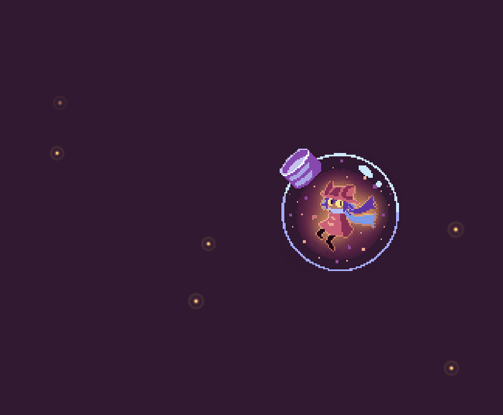

<h1 align="center">FocusTrigger | Anti-procrastinação</h1>

<p align="center">
  <a href="LICENSE">
    
  </a>
  
  
  
</p>

<p align="center">
  
</p>

<h2>
  
  Sobre o Projeto
</h2>

Este projeto nasceu da minha própria dificuldade em manter a constância nos estudos de Cálculo. Percebi que adiava os exercícios de **Limites**, então decidi criar uma ferramenta que me forçasse a praticar, nem que fosse um pouco, a cada hora.

O **FocusTrigger** interrompe qualquer atividade no computador e só libera a tela após o usuário interagir com o desafio matemático proposto, combatendo a preguiça e a inércia inicial.

<h2>
  
  Motivação
</h2>

* **Combate à preguiça:** O pop-up aparece sozinho, eliminando a barreira mental de "ter que começar".
* **Prática constante:** Resolver uma questão por hora é mais eficiente do que não resolver nada o dia todo.
* **Foco atual:** Configurado para **Limites**, conteúdo que estou cursando na faculdade no momento.

<h2>
     Funcionalidades
</h2>

- **Questões com IA:** Utiliza a **API do Claude (Anthropic)** via `requests` para gerar questões universitárias inéditas.
- **Fallback Offline:** Banco de dados local para garantir o funcionamento sem internet.
- **Modo Jogo (Tray):** Ícone na bandeja do sistema para pausar o app durante lazer ou reuniões.
- **Execução Silenciosa:** Roda em background sem janelas de terminal intrusivas.
- **Arquitetura Aberta:** Facilmente adaptável para Derivadas, Integrais, Física ou Idiomas.

<h2>
  
  Como Usar
</h2>

1. Baixe os arquivos e certifique-se de ter o **Python 3.x** instalado.
2. Execute o `setup_startup.bat` para instalar dependências e configurar a inicialização automática.
3. (Opcional) Insira sua chave da Anthropic quando solicitado para questões via IA.
4. Para desinstalar, basta executar o arquivo `desinstalar.bat`.

<h2>
  
  Estrutura do Projeto
</h2>

```bash
|-- FocusTrigger.py      # Script principal (Lógica, UI e Integração com IA)
|-- setup_startup.bat    # Automatiza a instalação e configuração no Windows
|-- desinstalar.bat      # Encerra processos e limpa registros do sistema
|-- requirements.txt     # Bibliotecas necessárias (pystray, Pillow, requests)
|-- apikey.txt           # Armazena localmente sua chave da Anthropic
└── README.md            # Documentação do projeto
